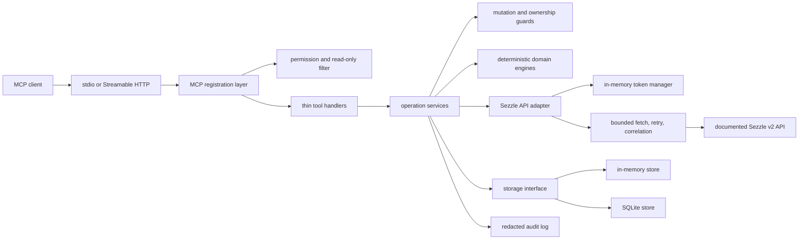

# SezzleOps MCP Architecture

## Purpose and boundaries

SezzleOps MCP is an unofficial, experimental, production-oriented Model Context Protocol design for merchant operations. It adds deterministic validation, approval gates, reconciliation, webhook correlation, diagnostics, least-privilege tool registration, and audit evidence around the documented Sezzle merchant API. Its API adapter has mocked integration coverage but has not been exercised with real Sezzle sandbox merchant credentials. It is not production-ready until [the sandbox checklist](docs/SANDBOX_VALIDATION.md) is completed.

The server name is `sezzle-ops`; the package and repository name is `sezzle-merchant-mcp`.

## Maturity boundary

The deterministic domain, permission, confirmation, storage, and transport behavior is locally tested. API compatibility is verified against the published OpenAPI document and mocked HTTP fixtures only. Live authentication, state transitions, error variants, rate limits, settlement payloads, and webhook delivery still require merchant sandbox validation. See [KNOWN_LIMITATIONS.md](KNOWN_LIMITATIONS.md).

## Sources of truth

- Sezzle documentation index: <https://docs.sezzle.com/llms.txt>
- Sezzle complete documentation: <https://docs.sezzle.com/llms-full.txt>
- Current Sezzle OpenAPI 3.1 specification: <https://docs.sezzle.com/openapi.yaml>
- MCP TypeScript SDK v1 production documentation: <https://ts.sdk.modelcontextprotocol.io/>
- MCP TypeScript SDK v1 source: <https://github.com/modelcontextprotocol/typescript-sdk/tree/v1.x>

The code targets the production-supported `@modelcontextprotocol/sdk` v1 line. The split v2 SDK is beta as of 2026-07-16 and is intentionally not used.

The Sezzle docs currently also link to `https://gateway.sezzle.com/v2api.yaml`, which returns 404. The working published specification is `https://docs.sezzle.com/openapi.yaml`. Endpoint paths and wire schemas live behind an adapter and endpoint catalog so a future specification change does not require MCP tool rewrites.

## Verified API surface

Phase 1 maps only to documented v2 endpoints:

| Capability             | Method and path                           |
| ---------------------- | ----------------------------------------- |
| Authenticate           | `POST /v2/authentication`                 |
| Create payment session | `POST /v2/session`                        |
| Get payment session    | `GET /v2/session/{session_uuid}`          |
| Cancel active checkout | `DELETE /v2/order/{order_uuid}/checkout`  |
| Get order              | `GET /v2/order/{order_uuid}`              |
| Update order reference | `PATCH /v2/order/{order_uuid}`            |
| Capture                | `POST /v2/order/{order_uuid}/capture`     |
| Refund                 | `POST /v2/order/{order_uuid}/refund`      |
| Release authorization  | `POST /v2/order/{order_uuid}/release`     |
| Reauthorize            | `POST /v2/order/{order_uuid}/reauthorize` |

The four financial POST operations document `Sezzle-Request-Id` for idempotency. No undocumented endpoint will be added. Optional or allowlisted fields are treated as absent unless returned by the API.

## Component model



The registration layer contains schemas and presentation only. Services own workflows. Domain modules own arithmetic and state validation. API modules own paths, wire schemas, authentication, retry policy, and response normalization. Storage implementations own persistence and idempotency records.

## Repository layout

```text
src/
  index.ts
  server/
    create-server.ts
    tool-result.ts
    transports/{stdio,http}.ts
  config/{env,permissions}.ts
  api/
    endpoint-catalog.ts
    sezzle-client.ts
    auth-client.ts
    request.ts
    errors.ts
    schemas/
  tools/{auth,sessions,orders,captures,refunds,settlements,reports,webhooks,diagnostics,reconciliation,support,audit}/
  services/
    audit-log.ts
    merchant-operations.ts
    mutation-guard.ts
    permission-guard.ts
    webhook-verifier.ts
    event-store.ts
    reconciliation-engine.ts
    diagnostics-engine.ts
    support-policy-engine.ts
  domain/{money,order,settlement,webhook,risk}.ts
  storage/{interface,memory-store,sqlite-store}.ts
  prompts/
  resources/
tests/{unit,integration,contract,security,fixtures}/
```

Only directories with working code or tests are created.

## Configuration and environment safety

Configuration is parsed once with Zod and passed explicitly. Defaults are sandbox, stdio, read-only, confirmation required, `read` permission, loopback HTTP binding, bounded concurrency, and finite request timeouts.

Production requires all of the following:

1. `SEZZLE_ENV=production`.
2. An exact production base URL (`https://gateway.sezzle.com`) unless an explicit custom-base override is enabled for controlled testing.
3. `SEZZLE_READ_ONLY=false` for mutation registration.
4. `SEZZLE_REQUIRE_CONFIRMATION=true` for high-impact operations.
5. A non-`read` permission profile with the required capability.

Sandbox credentials and production credentials are distinct. Authentication verifies that the token response merchant UUID matches `SEZZLE_MERCHANT_UUID` when configured. Base URLs are normalized and cannot contain embedded credentials, query strings, or fragments.

Secrets are wrapped in redacted configuration values, never serialized into resources, errors, audit records, or logs. Tokens remain in memory. The token manager refreshes before the documented 120-minute expiration and reacquires once after a 401; mutation replay occurs only when an idempotency key is present.

## Permission model

Tools are filtered before registration. A tool outside the active profile is absent from `tools/list`.

| Profile    | Capabilities                                                                               |
| ---------- | ------------------------------------------------------------------------------------------ |
| `read`     | authentication, merchant context, read sessions/orders/settlements/reports, safe summaries |
| `finance`  | `read` plus session/order mutations, capture, release, refund, reconciliation              |
| `webhooks` | webhook subscription management, test delivery, verification, ingestion, health            |
| `support`  | narrowly scoped support classification and authorized order explanations                   |
| `admin`    | all capabilities and audit inspection                                                      |

Read-only mode removes every state-changing tool even if the selected profile would otherwise grant it. Authentication token acquisition is not treated as a merchant-state mutation.

## Mutation protocol

No financial mutation can be inferred from prose. The execution input must contain literal `confirm: true`.

1. A preview reads current order state and validates currency, state transition, remaining authorized/refundable amount, and requested integer minor units.
2. The server creates an expiring preview record bound to merchant, environment, tool, target, normalized request hash, and observed state hash.
3. Execution requires `confirm: true`, the preview ID, an unchanged request, an unexpired preview, and a fresh state read that matches the preview assumptions.
4. The request uses a stable `Sezzle-Request-Id` where documented and stores the result against that key to detect duplicate attempts.
5. Success is claimed only from an API success response. Reauthorization additionally requires `authorization.approved === true`; HTTP 200 alone is not approval.
6. Every attempt emits a redacted audit event. Executed operations receive an audit ID whether they succeed or fail.

Mutation responses contain current known state, requested change, deterministic financial impact, validation, warnings, `executed`, and `auditId`. Capture, refund, and release have dedicated preview tools. Other mutations use the same tool with `confirm: false` for preview and `confirm: true` plus `previewId` for execution.

## Money and deterministic arithmetic

- API and MCP money values use safe integer minor units and uppercase ISO 4217 currency codes.
- Floating-point arithmetic is forbidden in domain and reconciliation modules.
- Addition, subtraction, comparison, and aggregation use `bigint` internally.
- JSON-facing values are emitted as safe integer minor units; values outside JavaScript's safe integer range are rejected at the boundary.
- Settlement CSV decimal text is parsed with a decimal-to-minor-unit parser using currency exponent metadata and explicit rounding rejection.
- JSON report fields documented as floats are parsed losslessly from response text before conversion. They never enter arithmetic as JavaScript floating-point values.
- Cross-currency values are never combined without an explicit, documented conversion amount from the source data.

## API client and error policy

`endpoint-catalog.ts` is the only module that owns paths and API version strings. The client accepts an injected `fetch` implementation for mock-server integration tests.

Requests have correlation IDs, timeout cancellation, bounded concurrency, structured redacted logging, and normalized errors. GET/HEAD requests may retry on timeouts, 429, and retryable 5xx responses with exponential backoff and `Retry-After`. Financial POST requests retry only when the documented idempotency header is present. Other mutations do not retry automatically.

Sezzle errors are arrays in the v2 OpenAPI examples, although some per-operation examples are objects. The adapter accepts both forms and emits one normalized error without a raw stack trace. Unknown response shapes fail closed as `SEZZLE_RESPONSE_INVALID`.

The current OpenAPI has a wire ambiguity for authorization events: component fields are flat (`amount_in_cents`, `currency_code`) while examples use nested `amount`. The adapter accepts only those two documented representations and normalizes both to one internal event type. This compatibility logic remains isolated and contract-tested.

## Reconciliation, webhooks, diagnostics, and support

Reconciliation accepts structured merchant records and normalized Sezzle records. Matching, duplicate detection, totals, payout calculation, confidence, and evidence references are deterministic. LLM-facing text can summarize evidence but cannot calculate or alter totals.

Webhook verification computes HMAC-SHA256 over the exact raw bytes before JSON parsing, compares signatures in constant time, stores a payload hash and verification result, and rejects invalid signatures. Event identity is the documented webhook `uuid`; repeated ingestion is idempotent. Timelines sort by occurrence time plus receipt sequence without assuming delivery order.

Diagnostics use stable finding codes and deterministic evidence. They can recommend actions but never execute them. Support services require explicit merchant/order authorization context, project API responses to the minimum necessary facts, and separate known facts, policy interpretation, suggested response, and human escalation. Drafting never asserts an action succeeded without stored API evidence.

## Transports

stdio writes protocol messages only to stdout; structured logs go to stderr. Streamable HTTP uses the SDK transport on `/mcp`, binds to loopback by default, validates host/origin, limits request bodies, and exposes a minimal unauthenticated `/health` response containing no merchant data. Remote exposure requires an explicit host setting and external authentication/TLS termination; production documentation treats unauthenticated public HTTP as unsupported.

## Validation strategy

Each phase must pass strict type checking and focused Vitest suites before the next phase. Tests cover domain arithmetic, schemas, permissions and non-registration, mutation preview/confirmation, mocked API contracts, retries, error normalization, redaction, reconciliation, webhook verification/order/deduplication, support data minimization, both transports, and production/sandbox barriers. Contract fixtures are derived from the published OpenAPI examples and contain no real credentials or customer data.

## Delivery phases

1. Runnable TypeScript/MCP foundation, configuration, permission filtering, API/auth client, normalized errors.
2. Complete Phase 1 read tools and guarded session/order/capture/refund/release/reauthorization flows.
3. Settlement/report adapters and deterministic reconciliation.
4. Webhook management, raw verification, event store, correlation, and health tools.
5. Integration Doctor and support policy interfaces.
6. Streamable HTTP hardening, resources, prompts, audit tools, SQLite persistence, Docker/CI/docs, and full validation.

No later phase weakens the Phase 1 approval, authorization, or arithmetic invariants.
