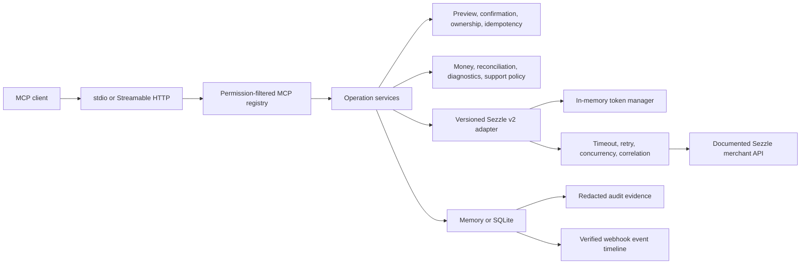

# Sezzle Merchant MCP

An unofficial, experimental, security-focused Model Context Protocol server for safe Sezzle merchant operations, settlement reconciliation, webhook monitoring, and integration diagnostics.

> **This project is unofficial and is not affiliated with, endorsed by, or maintained by Sezzle.**

No Sezzle logos are used. Sezzle trademarks belong to their respective owner.

## Project maturity

This project is an unofficial, experimental integration.

Its deterministic business logic, permission model, mutation guards, and mocked API integration are tested. However, the Sezzle API adapter has not yet been validated with real merchant sandbox credentials.

Do not enable production financial mutations until the [sandbox validation checklist](docs/SANDBOX_VALIDATION.md) has been completed.

Production-oriented and security-focused design does not mean production readiness. Live Sezzle sandbox validation is still required before production use.

> Analyze today’s Sezzle orders, identify uncaptured authorizations and refund mismatches, reconcile the latest settlement, inspect webhook health, and prepare safe actions without executing anything until I approve them.

Sezzle Merchant MCP is not a thin API wrapper. It adds deterministic money validation, mutation previews, explicit approval gates, permission-based tool registration, reconciliation evidence, webhook correlation, Integration Doctor findings, secure support routing, and redacted audit records around the documented Sezzle merchant API.

## Features

- Sandbox-first startup with read-only mode enabled by default.
- Documented Sezzle v2 merchant API adapter with in-memory token renewal.
- Capture, refund, release, session, reference, checkout, and webhook mutation previews.
- Literal `confirm: true`, expiring preview binding, fresh-state validation, and idempotency.
- Integer minor-unit money and `bigint` arithmetic; no floating-point financial calculations.
- Lossless parsing of settlement decimals and four-decimal interest-account values.
- Deterministic settlement matching, duplicate suppression, mismatch detection, expected payout, confidence, and evidence.
- Raw-byte HMAC-SHA256 webhook verification before parsing, idempotent ingestion, and occurrence-time timelines.
- Stable-code Integration Doctor findings and go-live checklists.
- PII-minimized support policy tools with merchant-reference ownership verification.
- Structured JSON logs to stderr, redacted resources, and durable audit metadata.
- MCP stdio and stateless Streamable HTTP transports.
- Memory and SQLite storage, Docker, Compose, CI, Dependabot, ESLint, Prettier, and Vitest.

## Architecture



MCP registration is intentionally thin. Services own workflows, domain modules own deterministic calculations, API modules own paths and wire schemas, and storage modules own previews, idempotency, audit events, and webhook records. See [ARCHITECTURE.md](ARCHITECTURE.md) for design decisions and documented API ambiguities.

## Safety Model

The default configuration is:

```env
SEZZLE_ENV=sandbox
SEZZLE_READ_ONLY=true
SEZZLE_REQUIRE_CONFIRMATION=true
SEZZLE_PERMISSION_PROFILE=read
MCP_TRANSPORT=stdio
```

Mutation tools are not registered while `SEZZLE_READ_ONLY=true`. They are absent from `tools/list`; they do not remain visible and return permission errors.

Financial and high-impact operations use two steps:

1. Call the preview tool, or call a combined mutation tool with `confirm: false`.
2. Review current state, requested change, financial impact, validation, warnings, expiry, and audit ID.
3. Repeat the unchanged request with the returned `preview_id` and literal `confirm: true`.

Execution fails if the preview expired, was already used, belongs to another merchant/target/environment, has a different request hash, or current state changed. The model cannot infer confirmation from natural language.

Example capture:

```json
{
  "tool": "sezzle_preview_capture",
  "arguments": {
    "order_uuid": "order-uuid",
    "amount": { "amount_in_cents": 2500, "currency": "USD" }
  }
}
```

After reviewing the preview:

```json
{
  "tool": "sezzle_capture_order",
  "arguments": {
    "order_uuid": "order-uuid",
    "amount": { "amount_in_cents": 2500, "currency": "USD" },
    "preview_id": "preview-from-first-call",
    "confirm": true
  }
}
```

Successful execution is reported only after a successful Sezzle API response. Reauthorization additionally requires `authorization.approved === true`; HTTP 200 alone is not treated as approval.

## Supported Tools

The generated [tool inventory](docs/TOOL_INVENTORY.md) currently verifies 55 tools, 6 resources, and 5 prompts. The active permission profile and read-only setting determine which tools are registered.

### Authentication, sessions, and orders

- `sezzle_authenticate_merchant`
- `sezzle_get_merchant_context`
- `sezzle_create_payment_session`
- `sezzle_get_payment_session`
- `sezzle_cancel_active_checkout`
- `sezzle_get_order`
- `sezzle_update_order_reference`
- `sezzle_preview_capture`
- `sezzle_capture_order`
- `sezzle_preview_refund`
- `sezzle_refund_order`
- `sezzle_preview_release_authorization`
- `sezzle_release_authorization`
- `sezzle_reauthorize_order`

### Settlements, reports, and reconciliation

- `sezzle_list_settlement_summaries`
- `sezzle_get_settlement_details`
- `sezzle_get_order_report`
- `sezzle_get_interest_balance`
- `sezzle_get_interest_activity`
- `sezzle_reconcile_settlement`
- `sezzle_find_unmatched_orders`
- `sezzle_detect_refund_mismatches`
- `sezzle_detect_capture_mismatches`
- `sezzle_detect_fee_anomalies`
- `sezzle_explain_payout_difference`
- `sezzle_generate_finance_daily_brief`

### Webhooks

- `sezzle_list_webhooks`
- `sezzle_create_webhook`
- `sezzle_update_webhook`
- `sezzle_delete_webhook`
- `sezzle_send_test_webhook`
- `sezzle_verify_webhook_signature`
- `sezzle_ingest_webhook_event`
- `sezzle_list_webhook_events`
- `sezzle_get_webhook_event`
- `sezzle_inspect_webhook_health`
- `sezzle_find_missing_order_events`
- `sezzle_detect_out_of_order_events`
- `sezzle_detect_duplicate_webhook_events`

### Integration Doctor

- `sezzle_diagnose_integration`
- `sezzle_validate_session_payload`
- `sezzle_validate_redirect_urls`
- `sezzle_audit_auth_capture_flow`
- `sezzle_detect_stuck_authorizations`
- `sezzle_detect_uncaptured_orders`
- `sezzle_detect_duplicate_refunds`
- `sezzle_test_webhook_configuration`
- `sezzle_generate_go_live_checklist`

### Support and audit

- `sezzle_explain_order_status_for_support`
- `sezzle_classify_support_request`
- `sezzle_draft_customer_response`
- `sezzle_determine_safe_support_route`
- `sezzle_identify_required_escalation`
- `sezzle_list_audit_events`
- `sezzle_get_audit_event`

## Permission Profiles

Set `SEZZLE_PERMISSION_PROFILE` to one profile:

| Profile    | Registered capabilities                                                                                            |
| ---------- | ------------------------------------------------------------------------------------------------------------------ |
| `read`     | Auth context, sessions, orders, settlements, reports, and Integration Doctor                                       |
| `finance`  | Read capabilities plus capture/refund/release/session/order previews, reconciliation, and write tools when enabled |
| `webhooks` | Subscription management, signature verification, ingestion, timelines, and health                                  |
| `support`  | Five isolated support tools; raw order read tools are not registered                                               |
| `admin`    | All capabilities and audit inspection                                                                              |

`read` is the default. Read-only mode independently removes every mutation tool from any profile.

## Installation

Requirements:

- Node.js 20 or later
- npm
- A Sezzle sandbox merchant account for API-backed testing

```bash
git clone https://github.com/onatozmenn/sezzle-merchant-mcp.git
cd sezzle-merchant-mcp
npm ci
npm run build
npm run inspect-tools
```

Available scripts:

```text
npm run dev
npm run build
npm run start
npm run test
npm run test:watch
npm run test:coverage
npm run lint
npm run typecheck
npm run format
npm run format:check
npm run inspect-tools
npm run docker:build
npm run docker:run
```

## Sandbox Setup

1. Create or obtain a Sezzle sandbox merchant account.
2. Generate sandbox API keys in the sandbox Merchant Dashboard.
3. Copy `.env.example` to `.env`.
4. Keep `SEZZLE_ENV=sandbox`, `SEZZLE_READ_ONLY=true`, and `SEZZLE_PERMISSION_PROFILE=read` initially.
5. Set `SEZZLE_MERCHANT_UUID`, `SEZZLE_API_KEY`, and `SEZZLE_API_SECRET`.
6. Build and connect an MCP client.
7. Validate authentication, read tools, Integration Doctor, and previews before enabling writes.

The default base URL is `https://sandbox.gateway.sezzle.com`. A custom loopback HTTP base URL is accepted only for mock integration tests.

## Production Setup

Production is fail-closed. It requires all of:

```env
SEZZLE_ENV=production
SEZZLE_API_BASE_URL=https://gateway.sezzle.com
SEZZLE_MERCHANT_UUID=your-production-merchant-uuid
SEZZLE_API_KEY=your-production-public-key
SEZZLE_API_SECRET=your-production-private-key
SEZZLE_READ_ONLY=true
SEZZLE_REQUIRE_CONFIRMATION=true
```

The authenticated merchant UUID must match `SEZZLE_MERCHANT_UUID`. Run the go-live checklist in read-only mode first. Enable an appropriate permission profile, then set `SEZZLE_READ_ONLY=false` only after review. Unsafe write mode with `SEZZLE_REQUIRE_CONFIRMATION=false` is rejected at startup.

Use a secret manager, encrypted SQLite storage, TLS termination, transport authentication, restrictive host/origin allowlists, monitoring, and backup/retention controls. Do not place production secrets in MCP client JSON committed to source control.

## Claude Desktop

Build the server, then add it to the Claude Desktop MCP configuration. Use an absolute path:

```json
{
  "mcpServers": {
    "sezzle-ops": {
      "command": "node",
      "args": ["C:\\absolute\\path\\to\\sezzle-merchant-mcp\\dist\\index.js"],
      "env": {
        "SEZZLE_ENV": "sandbox",
        "SEZZLE_READ_ONLY": "true",
        "SEZZLE_PERMISSION_PROFILE": "read"
      }
    }
  }
}
```

Inject credentials through the operating system or a secret-aware launcher rather than checking them into configuration files.

## Claude Code

Create a project-local `.mcp.json` that is excluded from source control when it contains credentials:

```json
{
  "mcpServers": {
    "sezzle-ops": {
      "type": "stdio",
      "command": "node",
      "args": ["/absolute/path/to/sezzle-merchant-mcp/dist/index.js"],
      "env": {
        "SEZZLE_ENV": "sandbox",
        "SEZZLE_READ_ONLY": "true",
        "SEZZLE_PERMISSION_PROFILE": "read"
      }
    }
  }
}
```

Restart the MCP session after changing environment variables.

## Cursor

Add the same stdio definition to Cursor's MCP configuration:

```json
{
  "mcpServers": {
    "sezzle-ops": {
      "command": "node",
      "args": ["/absolute/path/to/sezzle-merchant-mcp/dist/index.js"],
      "env": {
        "SEZZLE_ENV": "sandbox",
        "SEZZLE_READ_ONLY": "true",
        "SEZZLE_PERMISSION_PROFILE": "read"
      }
    }
  }
}
```

For VS Code, add the same stdio definition to your local user or workspace MCP settings after `npm run build`. Editor-local `.vscode/` configuration is intentionally excluded from the public repository.

## HTTP Transport

Enable stateless Streamable HTTP:

```env
MCP_TRANSPORT=http
MCP_HTTP_HOST=127.0.0.1
MCP_HTTP_PORT=3000
```

The MCP endpoint is `http://127.0.0.1:3000/mcp`; health is `GET /health`. Browser origins are rejected unless loopback or listed in `MCP_HTTP_ALLOWED_ORIGINS`.

Every non-loopback bind requires both:

```env
MCP_HTTP_AUTH_TOKEN=a-long-random-transport-token
MCP_HTTP_ALLOWED_HOSTS=mcp.example.com
MCP_HTTP_ALLOWED_ORIGINS=https://trusted-client.example
```

Terminate TLS at a trusted reverse proxy and send `Authorization: Bearer <token>`. `/health` is intentionally unauthenticated and contains no merchant state. HTTP request bodies are limited to 1 MB; webhook ingestion tool inputs are additionally schema-limited.

## Docker

Build and run stdio:

```bash
npm run docker:build
npm run docker:run
```

For HTTP plus persistent SQLite, set `MCP_HTTP_AUTH_TOKEN` in `.env` and run:

```bash
docker compose up --build
```

Compose uses a non-root image, read-only root filesystem, dropped capabilities, a dedicated SQLite volume, and a health check.

## Example Workflows

### Daily operations review

1. Read `sezzle://config`, `sezzle://permissions`, and `sezzle://capabilities`.
2. Authenticate and verify the merchant/environment.
3. Fetch scoped order/report evidence.
4. Run `sezzle_detect_uncaptured_orders`, reconciliation, and webhook health checks.
5. Prepare capture/refund/release previews.
6. Present audit IDs, warnings, and expected financial impact.
7. Stop without executing unless the user separately approves a specific preview.

### Refund workflow

1. Call `sezzle_preview_refund` with an integer minor-unit amount.
2. Confirm the current captured, refunded, and remaining-refundable amounts.
3. Resolve warnings or validation failures.
4. Call `sezzle_refund_order` with the unchanged request, `preview_id`, and `confirm: true`.
5. Treat the returned transaction UUID and request ID as API evidence.

## Webhook Setup

Sezzle documents HMAC-SHA256 over the exact raw webhook body using the merchant signing secret. Configure the value separately:

```env
SEZZLE_WEBHOOK_SECRET=your-signing-secret
```

Use `sezzle_create_webhook` in write-enabled `webhooks` or `admin` mode. It previews URL/event-set changes before confirmation.

For ingestion:

1. Preserve the exact request bytes as a UTF-8 string.
2. Pass the exact raw body and `Sezzle-Signature` value to `sezzle_verify_webhook_signature`.
3. Call `sezzle_ingest_webhook_event` with literal `confirm: true` only after verification policy allows storage.
4. Invalid signatures are rejected before JSON parsing.
5. Event UUID and payload hash deduplicate repeated delivery.
6. Timelines order by `occurredAt`, not receipt order.

Public event tools return metadata and correlation IDs, not raw bodies. SQLite preserves verified raw bodies because correlation and forensic requirements depend on them; protect and retain that database as merchant-sensitive data.

## Reconciliation Example

Reconciliation accepts merchant orders and normalized settlement line items as structured input. Amounts are integer cents:

```json
{
  "input": {
    "currency": "USD",
    "merchant_orders": [
      {
        "record_id": "merchant-1001",
        "order_reference": "order_1001",
        "sezzle_order_uuid": "sezzle-order-uuid",
        "currency": "USD",
        "order_amount_in_cents": 10000,
        "captured_amount_in_cents": 8000,
        "refunded_amount_in_cents": 1000,
        "expected_fee_in_cents": 480
      }
    ],
    "sezzle_records": [
      {
        "record_id": "capture-row-1",
        "type": "CAPTURE",
        "order_uuid": "sezzle-order-uuid",
        "external_reference_id": "order_1001",
        "amount_in_cents": 8000,
        "currency": "USD"
      }
    ],
    "actual_settlement": { "amount_in_cents": 6520, "currency": "USD" },
    "fee_tolerance_in_cents": 0
  }
}
```

Every result includes `summary`, `matched`, `unmatchedMerchantRecords`, `unmatchedSezzleRecords`, `amountMismatches`, `feeAnomalies`, `confidence`, and `evidence`. Duplicate rows are excluded before payout arithmetic. Currency conversion is never inferred.

## Integration Doctor Example

```json
{
  "input": {
    "now": "2026-07-16T12:00:00Z",
    "configured_environment": "sandbox",
    "credential_environment": "sandbox",
    "api_base_url": "https://sandbox.gateway.sezzle.com",
    "orders": [],
    "webhooks": {
      "subscribed_events": ["order.authorized"],
      "required_events": ["order.authorized", "order.captured"],
      "invalid_signature_count": 0,
      "missing_events": [],
      "out_of_order_count": 0
    }
  }
}
```

Findings contain stable `code`, `severity`, `title`, `explanation`, `evidence`, `recommendedAction`, and `safeToAutomate: false`. The engine reports evidence; it does not execute repairs.

## MCP Resources

- `sezzle://config`
- `sezzle://permissions`
- `sezzle://capabilities`
- `sezzle://diagnostic-codes`
- `sezzle://audit-summary` (`admin` only)
- `sezzle://webhook-health` (`webhooks` or `admin`)

Resources never expose API keys, secrets, bearer tokens, signatures, raw webhook bodies, or customer records.

## MCP Prompts

- `sezzle_daily_operations_review`
- `sezzle_settlement_reconciliation`
- `sezzle_integration_go_live_review`
- `sezzle_webhook_incident_investigation`
- `sezzle_support_case_review`

Prompts are profile-aware and direct the model to collect evidence before interpretation, use deterministic arithmetic, distinguish facts from recommendations, prepare previews, and avoid unsupported success claims.

## Security Considerations

- Never log or commit API keys, bearer tokens, webhook signatures, raw payloads, customer PII, or payment details.
- Tokens remain in memory and are refreshed before the documented expiry. A 401 triggers one reacquisition; a mutation is replayed only when it carries documented idempotency.
- Safe GETs respect timeouts, exponential backoff, `Retry-After`, and concurrency limits.
- Webhook subscription/session/reference mutations are not retried automatically because their endpoints do not document idempotency.
- Settlement JSON decimals use a lossless parser. CSV decimals are converted from text directly to scaled integers.
- Support order access requires authenticated merchant access and a matching merchant reference. Returned order projections exclude customer fields.
- SQLite preserves raw verified webhook bodies. Use encrypted storage, strict access, backups, and retention controls.
- Remote HTTP requires transport authentication, allowed hosts, TLS termination, and network controls.
- Review [SECURITY.md](SECURITY.md) before production deployment.

## Known Limitations

- `GET /v2/orders/report` is available by request only and supports a maximum seven-day range.
- Interest endpoints require enrollment in Sezzle's interest account program.
- Settlement details are CSV; schema changes by Sezzle may require adapter updates.
- The Sezzle documentation currently links to `https://gateway.sezzle.com/v2api.yaml`, which returns 404. This project uses the published `https://docs.sezzle.com/openapi.yaml`.
- Authorization event examples and their component schema use two documented shapes; the adapter supports those two shapes only.
- The upcharge API is marked in development and not available for production, so it is intentionally not exposed.
- No documented endpoint lists arbitrary current merchant orders. Integration Doctor and reconciliation accept scoped structured records rather than scraping a dashboard.
- The order report API includes customer fields; Sezzle Merchant MCP removes them from its normalized response.
- Streamable HTTP is stateless. Durable workflow state belongs in SQLite; multi-node shared storage is not implemented.
- SQLite data is not application-level encrypted. Use encrypted disks/volumes and platform access controls.
- OAuth is not bundled. Remote deployments use a configured bearer token and should sit behind a production identity-aware reverse proxy.
- Support drafting is deterministic policy templating, not an embedded LLM. The MCP client may use the returned facts/policy to assist drafting.

## Roadmap

- Shared transactional storage for multi-node HTTP deployments.
- Pluggable secret-manager and encrypted-record integrations.
- Configurable webhook retention and deletion policies.
- OAuth/OIDC deployment adapter for remote MCP clients.
- OpenAPI contract drift automation against published Sezzle specifications.
- Additional reconciliation import adapters that preserve deterministic core types.

## Source of Truth

- Sezzle documentation index: <https://docs.sezzle.com/llms.txt>
- Sezzle OpenAPI specification: <https://docs.sezzle.com/openapi.yaml>
- MCP TypeScript SDK v1 documentation: <https://ts.sdk.modelcontextprotocol.io/>
- MCP TypeScript SDK v1 source: <https://github.com/modelcontextprotocol/typescript-sdk/tree/v1.x>

No endpoint absent from the published Sezzle OpenAPI specification is intentionally exposed.

## License

MIT. See [LICENSE](LICENSE).
